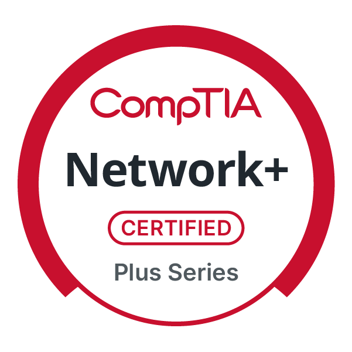
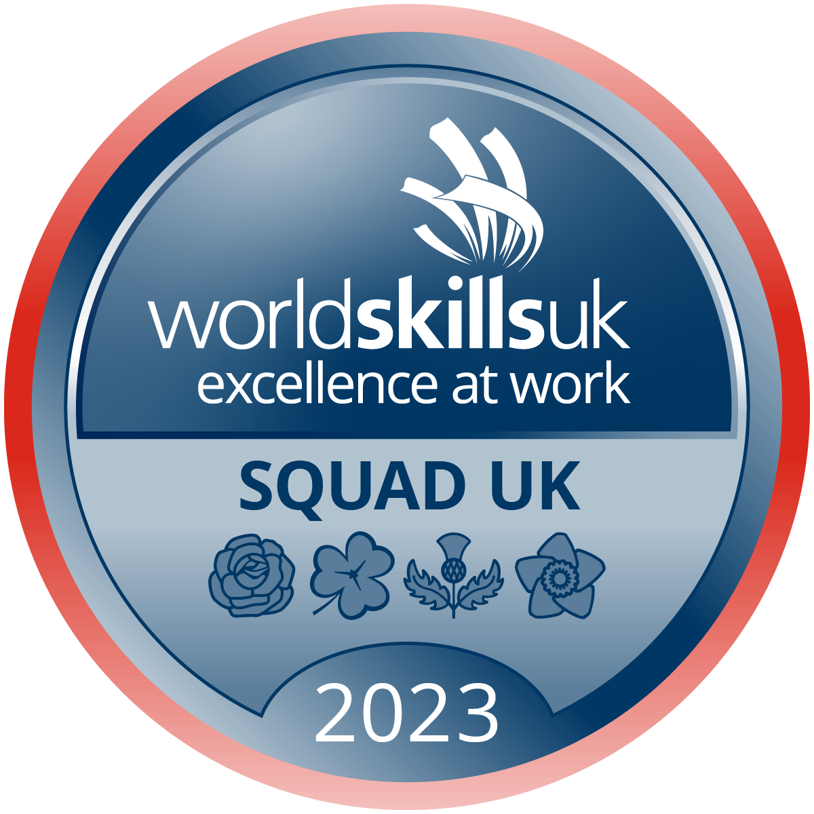

<a href="https://cv.ryancranie.com" target="_blank" style="font-family:'JetBrains Mono',monospace;font-size:13px;color:rgba(255,255,255,0.6);text-decoration:underline;text-decoration-color:rgba(255,255,255,0.3);">view my complete cv ↗</a>

---

## Work Experience

### IT Workplace Support Analyst
#### SEFE Energy · August 2025 – Present

Working in 2nd line IT support within a hybrid Azure AD environment. Day-to-day responsibilities span endpoint provisioning via Autopilot and Intune, device lifecycle management for joiners/movers/leavers, and advanced network troubleshooting across VPN, WiFi, and Azure-identity-driven authentication. Also leading documentation and process modernisation projects, using spreadsheet automation and data modelling to standardise and track operational work.

---

## Education

### BSc (Hons) Cyber Security and Networks
#### Glasgow Caledonian University · 1st Class Honours, July 2025

Graduated top of my year, awarded Best 4th Year Student. Elected Class Representative for 2024/25. Notable modules include Enterprise Networking, SOC Operations Analysis, and Applied Penetration Testing.

---

## Certifications

Currently working towards CCNA - exam booked for April 2026.

CompTIA Network+

N10-009 · March 2026

CompTIA Security+

SY0-701 · March 2026

WorldSkills Squad UK

2023

---

## Achievements

- Awarded Best 4th Year Student - graduated top of year (2025)
- Elected Class Representative - 4th Year BSc Cyber Security & Networks, GCU (2024/25)
- WorldSkills UK IT-NSA Squad Member (2022-2026)
- Top 4 from 200+ participants in WorldSkills IT-NSA national selection (2022)
- WorldSkills UK Medallion of Excellence - National Competition (2022)
- WorldSkills Asia 2023 - Team UK representative, Abu Dhabi (2023)
