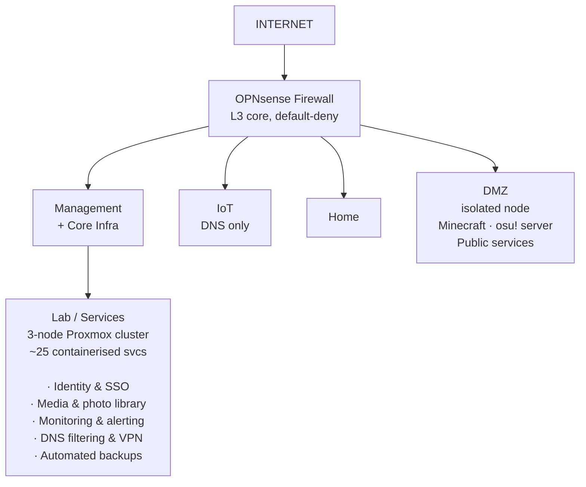

## Homelab

I've been running a self-hosted home network - not as a sandbox, but as infrastructure I actually depend on. Everything from DNS and VPN access to media, backups, and game servers runs on it. Designing, breaking, and fixing it has been the most useful technical education I've had.

The network is segmented into isolated zonesm: internal services, IoT, home devices, and a public-facing DMZ - enforced by a dedicated firewall with a default-deny policy between segments. The compute layer is a three-node virtualisation cluster. All application deployments are managed through Git and Docker Compose; no click-ops, full rollback capability.

What I find genuinely interesting and valuable about it: real infrastructure has real failure modes. When something breaks I have to dig into logs, trace routing decisions, and work out what I missed. That feedback loop is hard to replicate any other way.

The DMZ runs on a physically separate node, VLAN 50 is pruned at the switch so it is only reachable from that machine. Public services are fronted by Cloudflare; the internal network is never directly exposed.

Hosting game servers in the DMZ is something I have particularly enjoyed. It forced me to think carefully about how you give something internet access while keeping it genuinely isolated from everything else on the network.

For a detailed technical writeup and full documentation of the build, see the [homelab repository on GitHub](https://github.com/ryancranie/homelab).

---

## Research

### Lightweight Cryptography for Secure Firmware Updates in IoT
#### Undergraduate Thesis — Glasgow Caledonian University, 2025

In this study, we explored the implementation of lightweight cryptographic protocols for securing over-the-air firmware updates in resource-constrained smart home IoT devices. The research examined the performance and security trade-offs of various protocols including AES-128, ChaCha20, ECDSA, and Ed25519. Through our testing methodology using OpenSSL for encryption and signing, mitmproxy for simulating network attacks, and comprehensive traffic analysis with tcpdump and Wireshark, we aimed to identify optimal cryptographic solutions that balance security requirements with the computational limitations of IoT hardware.

---

## University Projects

### Dijhitech Research Labs — Internal Penetration Test
#### Applied Penetration Testing — Graded Group Project

For our university project, we conducted a black-box penetration test in a simulated environment. The final report we made offers a detailed analysis of nine vulnerabilities identified, along with recommended remediations for each. This project also provided valuable leadership experience, as I took responsibility for task delegation and organizing team meetings. I was fortunate to collaborate with a talented group of classmates throughout the process.

### Security Assessment of a Simulated Chemical Plant ICS
#### Cyber Physical Systems Security: Coursework

This individual project was to make a comprehensive security assessment of a simulated chemical plant's Industrial Control System. The goal was to aim to identify vulnerabilities within the ICS and evaluate its resilience against a variety of cyberattacks. The assessment involves creating an asset inventory through network scanning and traffic analysis, identifying and analyzing ICS devices, and conducting vulnerability assessments and attacks, including a perception layer attack and a man-in-the-middle attack.